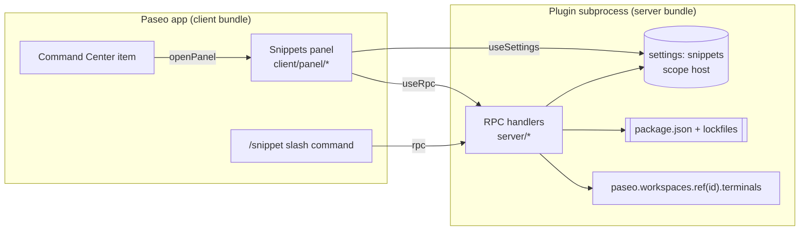

# paseo-workspace-snippets: implementation plan

Status: plan only. No plugin code exists yet beyond the `paseo plugin init` scaffold.

Target: Paseo 0.10.2 (`@getpaseo/plugin` 0.10.2, `requirements.paseo >=0.10.2`). API names below are
taken from the installed `.d.ts` files, not only from the deployed docs. The deployed docs already
describe a newer client API (`addScreen` / `addSidebarHeaderItem`); 0.10.2 still has
`addSurface` / `addSidebarItem`. This plugin uses neither, so the difference does not matter here.

## 1. Goal and scope

For each workspace, a panel that:

1. **Scripts**: lists every entry in the `scripts` field of the workspace root `package.json`, each
   with a run button, using the detected package manager.
2. **Snippets**: lets the user add, edit, delete and run their own shell commands (for example
   `npm run dev`). Snippets are saved per project (shared by every worktree of the repo) or per
   workspace (one directory only).
3. Runs each entry in its own named Paseo terminal, reuses that terminal, and offers Stop, Restart,
   Close and a short output preview.

Out of scope for v1: monorepo `workspaces` packages, nested `package.json` files, environment
variable editing, port allocation, health checks, importing or exporting snippets, and running
anything from an agent context.

### Relation to `paseo.json` scripts and services

`paseo.json` `scripts` are committed with the repo, run in supervised terminals, and services get
`$PASEO_PORT`, `$PASEO_URL`, peer-service variables and a reverse proxy URL. This plugin does not
replace or read them:

| | `paseo.json` scripts/services | This plugin |
|---|---|---|
| Where defined | Committed file, read from the base branch | Host-local settings + live `package.json` |
| Needs a commit / config | Yes | No |
| Supervision, ports, proxy, health | Yes (services) | No: a plain interactive shell |
| Environment | `PASEO_*` variables | The user's login shell (nvm, PATH, direnv) |
| Who sees it | Everyone who clones the repo | Only this daemon host |

Guidance shown in the panel's empty state and README: use `paseo.json` services for team-shared,
port-bound dev servers; use this plugin for personal commands you do not want to commit and for
zero-config access to `package.json` scripts. v1 does not detect or deduplicate entries that also
appear in `paseo.json`. That stays a possible follow-up only if users report confusion.

## 2. Architecture



**Decision: all terminal orchestration runs on the server.** Server handlers receive the same
`PaseoApi` as `{ paseo }` (`PluginHandlerContext`). Putting run/stop/restart/status/output behind
RPCs gives the panel, the slash command and the Command Center one code path, lets the server
resolve the workspace directory itself (the client never sends a filesystem path), and lets the
slash command look up snippets by name through `server.registerSettings(...).read()`. Running it
in the client with `usePaseo()` would work too, but the lookup and the reuse logic would then be
duplicated between React code and command callbacks.

### Files

| File | Runtime | Contents |
|---|---|---|
| `paseo-plugin.json` | manifest | Add `description`. Keep `requirements.paseo >=0.10.2`. |
| `index.client.tsx` | client | Register the panel, the Command Center item and the slash command. |
| `index.server.ts` | server | `registerSettings(snippetsSettings)`, `server.handle(...)` for every RPC. |
| `shared/settings.ts` | shared | `snippetsSettings` (`defineSettings`) and the `Snippet` schema. |
| `shared/rpc.ts` | shared | All `defineRpc` contracts (section 3). |
| `shared/entries.ts` | shared | Pure helpers: `entryKey`, `terminalName`, `shellQuote`, `scriptCommand(pm, name)`, `snippetsFor(values, ctx)`. No Node, no React. |
| `server/workspace.ts` | server | `resolveWorkspace(paseo, workspaceId)` → `{ directory, projectRootPath }` from `paseo.workspaces.ref(id).refresh()`; throws `WORKSPACE_UNAVAILABLE`. |
| `server/package-json.ts` | server | `detectScripts(directory)`: confined read of `package.json`, package-manager detection. |
| `server/terminals.ts` | server | `findTerminal`, `run`, `stop`, `restart`, `close`, `output`. |
| `server/entries.ts` | server | Resolve an entry key or a name to `{ key, label, command }` from settings and `package.json`. |
| `client/panel/SnippetsPanel.tsx` | client | Panel root: header, sections, loading/error states. |
| `client/panel/ScriptsSection.tsx` | client | Detected scripts list. |
| `client/panel/SnippetsSection.tsx` | client | Snippet list and the add button. |
| `client/panel/EntryRow.tsx` | client | One row: label, command, status, Run/Restart/Stop/Close, expand-to-preview. |
| `client/panel/SnippetEditor.tsx` | client | Add/edit form in a host `Modal`. |
| `client/panel/OutputPreview.tsx` | client | Polled tail of terminal output. |
| `client/panel/styles.ts` | client | `makeStyles(theme, compact)`; every color from `theme.colors`. |

To delete (scaffold greeting example): `client/greeting.tsx`, `server/greeting.ts`,
`shared/greeting.ts`, `client/web.ts` (the plugin needs no DOM API; recreate it only if one is ever
needed), and the greeting registrations in `index.client.tsx` / `index.server.ts`. Update
`README.md` "Status" when v1 lands.

## 3. Schemas

### Settings (`shared/settings.ts`)

```ts
import { defineSettings } from "@getpaseo/plugin";
import { z } from "zod";

export const SnippetSchema = z.object({
  id: z.string().min(1),                 // random, stable; used in entry keys
  name: z.string().trim().min(1).max(60),
  command: z.string().trim().min(1).max(4000),
  scope: z.enum(["project", "workspace"]),
});
export type Snippet = z.infer<typeof SnippetSchema>;

export const snippetsSettings = defineSettings({
  id: "snippets",
  scope: "host",
  version: 1,
  schema: z.object({
    // key: projectRootPath (scope "project") — shared by every worktree of the project
    projects: z.record(z.string(), z.array(SnippetSchema)).default({}),
    // key: workspace directory (scope "workspace")
    workspaces: z.record(z.string(), z.array(SnippetSchema)).default({}),
    showScripts: z.boolean().default(true),
  }),
});
```

Keying decision: paths, not IDs. `projectRootPath` stays the same across worktrees and is
readable in the JSON file; workspace IDs disappear when a worktree is archived, while a directory
key lets a re-created workspace on the same path find its snippets. Task 1 confirms that a
worktree workspace reports the source checkout as `projectRootPath`; if it does not, switch the
project key to `projectId`.

Name uniqueness: names are unique within the merged list a workspace shows (project + workspace
snippets); the editor rejects duplicates, since the slash command resolves by name.

Writes: the panel saves full documents with `save(values, revision)`. A `false` result shows
`saveError` and keeps the editor open with the draft (revision conflict or validation failure).

### Entry keys and terminal names (`shared/entries.ts`)

- Entry key: `script:<scriptName>` or `snippet:<snippetId>`.
- Terminal name: `script:<scriptName>` or `snippet:<snippetName>`. The name is what the user sees
  if the terminal shows up as a tab (Task 1).
- Lookup is by the terminal name within one workspace. Renaming a snippet orphans its terminal
  name; the rename handler kills the old terminal if one is open, after confirming with the user.

### RPC contracts (`shared/rpc.ts`)

Every input carries `workspaceId`; the server derives paths from it.

```ts
const WorkspaceInput = z.object({ workspaceId: z.string().min(1) });
const EntryInput = WorkspaceInput.extend({ entryKey: z.string().regex(/^(script|snippet):.+$/) });

export const detectScriptsRpc = defineRpc({
  name: "scripts.detect",
  input: WorkspaceInput,
  output: z.object({
    status: z.enum(["ok", "missing", "invalid"]),   // missing = no package.json; invalid = parse/shape error
    error: z.string().nullable(),
    packageManager: z.enum(["npm", "pnpm", "yarn", "bun"]),
    scripts: z.array(z.object({ name: z.string(), body: z.string(), command: z.string() })),
  }),
});

export const terminalStatesRpc = defineRpc({
  name: "terminals.states",
  input: WorkspaceInput,
  output: z.object({ open: z.record(z.string(), z.string()) }), // terminal name -> terminal id
});

export const runEntryRpc = defineRpc({
  name: "entry.run",                       // creates if missing, otherwise restarts
  input: EntryInput,
  output: z.object({ terminalId: z.string(), created: z.boolean() }),
});
export const stopEntryRpc = defineRpc({ name: "entry.stop", input: EntryInput, output: z.object({ stopped: z.boolean() }) });
export const closeEntryRpc = defineRpc({ name: "entry.close", input: EntryInput, output: z.object({ closed: z.boolean() }) });
export const entryOutputRpc = defineRpc({
  name: "entry.output",
  input: EntryInput.extend({ lines: z.number().int().min(1).max(200).default(40) }),
  output: z.object({ open: z.boolean(), lines: z.array(z.string()), totalLines: z.number() }),
});
export const runByNameRpc = defineRpc({
  name: "entry.runByName",                 // slash command
  input: WorkspaceInput.extend({ name: z.string().trim().min(1) }),
  output: z.object({ entryKey: z.string(), terminalId: z.string() }),
});
export const listEntriesRpc = defineRpc({
  name: "entry.list",                      // slash command with no args, error hints
  input: WorkspaceInput,
  output: z.object({ names: z.array(z.string()) }),
});
```

Errors are thrown from handlers as `Error` with a stable prefix (`WORKSPACE_UNAVAILABLE:`,
`ENTRY_NOT_FOUND:`, `AMBIGUOUS_NAME:`, `PATH_OUTSIDE_WORKSPACE:`, `TERMINALS_UNSUPPORTED:`). The
client maps the prefix to a message (section 7). They are also logged with `console.error`, so they
appear in `paseo plugin logs`.

## 4. Server behavior

### `package.json` detection (`server/package-json.ts`)

1. `directory` comes from `resolveWorkspace`, never from the client.
2. `realDir = fs.realpath(directory)`; `file = path.join(realDir, "package.json")`;
   `realFile = fs.realpath(file)`. Reject with `PATH_OUTSIDE_WORKSPACE` unless
   `path.relative(realDir, realFile)` is non-empty, not absolute, and does not start with `..`.
   This covers a `package.json` symlinked outside the workspace. `ENOENT` → `status: "missing"`.
3. Read at most 1 MiB (`stat` first). `JSON.parse`; `scripts` must be an object of strings;
   non-string values are skipped. Parse or shape error → `status: "invalid"` with the message.
4. Package manager: `packageManager` field (`"pnpm@9.1.0"` → `pnpm`) wins; otherwise the first
   lockfile found in `realDir`: `pnpm-lock.yaml` → pnpm, `yarn.lock` → yarn, `bun.lockb` or
   `bun.lock` → bun, otherwise npm. Lockfile checks use `fs.access` on `path.join(realDir, name)`
   only.
5. `command = "<pm> run " + shellQuote(name)` (`shellQuote` single-quotes names with characters
   outside `[A-Za-z0-9:._/-]`).
6. Sorted by the order in `package.json` (object key order), not alphabetically.

No caching on the server; the client caches through TanStack Query and refetches on panel focus
and on the Refresh button. There is no file watcher in v1.

### Terminal lifecycle (`server/terminals.ts`)

The terminal runs the user's default shell; the command is typed into it:

```ts
const ws = paseo.workspaces.ref(workspaceId);
const { entries } = await ws.terminals.list();
const existing = entries.find((t) => t.name === terminalName);
```

| Action | Terminal missing | Terminal open |
|---|---|---|
| Run | `ws.terminals.create({ name, cwd: directory })`, then `write(command)` + `sendKeys(["Enter"])` | Same as Restart |
| Restart | Same as Run | `sendKeys(["C-c"])`, wait 300 ms, `write(command)` + `sendKeys(["Enter"])` |
| Stop | no-op, `stopped: false` | `sendKeys(["C-c"])` |
| Close | no-op, `closed: false` | `paseo.terminals.ref(id).kill()` |
| Output | `open: false, lines: []` | `capture({ start: -lines, stripAnsi: true })`, trailing blank lines trimmed |

Why the default shell plus typed input instead of `command`/`args`: the command runs with the
user's interactive environment (nvm, PATH, aliases), shell syntax (`&&`, pipes, env prefixes)
works without wrapping, and the terminal stays open after the command exits, so the user can read
the output or press up-arrow. Cost: the plugin cannot see whether the command is still running or
its exit code (`PaseoTerminal` only has `id`, `workspaceId`, `cwd`, `name`). The UI therefore
shows "terminal open" / "not running", never "running" or "exited". The preview fills that gap.

Notes:
- `sendKeys` takes an array (`readonly string[]`), not a string.
- Restart sends `C-c` even if the previous command has already exited; on an idle shell that only
  prints a fresh prompt.
- Multi-line snippets: `write` the text as-is, then `Enter`. Each line runs as a separate shell
  command. The editor shows that as a hint.
- Input typed right after `create` is buffered by the PTY before the shell prompt appears; Task 1
  confirms this. If it gets lost, wait for the first non-empty `capture` (poll every 100 ms, up to
  3 s) before writing.
- Concurrency: two quick Run presses could create two terminals with the same name. The server keeps
  an in-memory `Map<workspaceId + name, Promise>` and chains operations on the same key.
- Duplicate names that already exist (created elsewhere): use the first match.
- The server entry cleanup does not kill terminals: they belong to the workspace and must survive
  a plugin reload.

## 5. Panel UX

Registration (`index.client.tsx`):

```ts
client.addWorkspacePanel({
  id: "snippets",
  title: "Snippets",
  icon: "SquareTerminal",
  context: "workspace",
  locations: ["workspace", "explorer"],
  Component: SnippetsPanel,
});
```

Data sources in the panel:
- `useWorkspace(workspaceId, (w) => ({ directory: w.directory, projectRootPath: w.projectRootPath, name: w.name }))`
  for the settings keys and the header. The panel does not send these paths to the server.
- `useSettings(snippetsSettings)` for snippets.
- TanStack Query: `["detect", workspaceId]` → `scripts.detect`; `["states", workspaceId]` →
  `terminals.states`, refetched every 3 s while the panel is mounted and after every action;
  `["output", workspaceId, entryKey]` → `entry.output`, every 1.5 s, only for expanded rows.

Layout (one `ScrollView`, React Native primitives only, colors only from `theme.colors`):

```
Snippets · <workspace name>                       [↻ Refresh]
─ Scripts (npm · package.json) ───────────────────────────────
  dev     vite                    ● open   [Restart] [Stop] [✕]  ▸
  build   tsc && vite build                [Run]                 ▸
─ Snippets ─────────────────────────────────────── [+ Add] ───
  Dev server   npm run dev        project  ● open  [Restart] …  ▸
  Seed DB      npm run db:seed    workspace        [Run] [✎] [🗑] ▸
  ▾ output (last 40 lines, monospace, foregroundMuted)
```

- Status dot: `theme.colors.accent` when the terminal is open, `foregroundMuted` otherwise; the text
  label always says "open" / "not running" so color is not the only signal.
- Row actions: Run (missing) or Restart (open); Stop and Close only when open; Edit and Delete for
  snippets. Every `Pressable` has `accessibilityRole="button"` and an `accessibilityLabel` that
  includes the entry name. Buttons are disabled while their mutation is pending.
- Expand chevron shows `OutputPreview` (monospace `Text`, `selectable`, max 40 lines, scrolls to the
  end). Collapsed rows do not poll.
- Section hidden when `showScripts` is false; a small toggle in the section header writes it.
- Compact layout (`layout.compact`): rows stack: label + status on the first line, command
  (one line, ellipsized) on the second, actions on the third as icon buttons (`Icon` from
  `@getpaseo/plugin/client/react-native`) with accessibility labels; padding 16 instead of 24.
- Snippet editor: host `Modal` (bottom sheet on compact). Fields: Name (`TextInput`), Command
  (multi-line `TextInput`), Scope (two-option segmented control: "This project" / "This workspace").
  Validate with `SnippetSchema` plus the uniqueness check, inline error under the field. Save →
  `save(next, revision)`; on `false` show `saveError` and keep the draft. Delete asks for
  confirmation in the same `Modal`; if the snippet's terminal is open, offer "Delete and close
  terminal".
- Toasts (`useToast`) for action failures; inline messages for section-level states.
- After Run/Restart, if Task 1 shows terminals appear as tabs, show a one-line hint
  "Opened in terminal tab `snippet:<name>`". Otherwise the row expands its preview automatically.

## 6. Command Center and slash command

- Command Center (workspace context): `id: "open-snippets"`, title "Open snippets", icon
  `SquareTerminal`, keywords `["run", "script", "npm", "terminal"]`, `onSelect({ openPanel }) {
  openPanel("snippets"); }`. Per-snippet Command Center items are not registered in v1: items are
  registered per client, not per workspace, and the snippet list is per workspace. One static item
  that opens the panel avoids stale registrations.
- Slash command (workspace context, so drafts get it too): `name: "snippet"`,
  `description: "Run a saved snippet or package.json script in a terminal"`,
  `argumentHint: "<name>"`.
  - With args: `rpc(runByNameRpc, { workspaceId: workspace.id, name: args })`. Resolution: an exact
    snippet name first, then an exact script name, then a case-insensitive unique prefix across
    both. No match → `ENTRY_NOT_FOUND`; several → `AMBIGUOUS_NAME` with the candidates. Paseo shows
    the thrown error as a toast.
  - Without args: `openPanel("snippets")`.
  - Before Task 4, check that `snippet` does not collide with a built-in command (a collision
    silently drops the plugin command); fall back to `run-snippet`.

## 7. Error states

| Situation | Where | Behavior |
|---|---|---|
| Workspace unknown/archived | RPC → `WORKSPACE_UNAVAILABLE` | Panel shows "Workspace is not available on this host"; actions disabled. |
| Host lacks terminal support | SDK throws update-host error → `TERMINALS_UNSUPPORTED` | Banner "Update the Paseo daemon to run snippets"; list still renders. |
| No `package.json` | `status: "missing"` | Scripts section shows "No package.json in <directory>". |
| Invalid `package.json` | `status: "invalid"` | Section shows the parse error; snippets unaffected. |
| `package.json` symlinked outside | `PATH_OUTSIDE_WORKSPACE` | Section error; nothing read. |
| No scripts | `scripts: []` | "package.json has no scripts". |
| Settings `loading` | `useSettings` | Skeleton; never render defaults as saved. |
| Settings `invalid` / `error` | `useSettings` | Error text + "Reload" (`reload()`) and, for `invalid`, "Reset snippets" (`reset()`) behind a confirmation. |
| Save conflict/validation | `save()` → `false` | Editor stays open, shows `saveError`. |
| Terminal disappears between list and action | `kill`/`capture` on missing id | Treated as "not open"; states refetched. |
| Slash command no match / ambiguous | thrown error | Toast with the candidate names. |
| Plugin RPC rejected (schema) | `useRpc` rejects | Toast with the message; `paseo plugin logs` has the detail. |

## 8. Tasks

Shared verification commands (the CLI is not on `PATH`):

```bash
PASEO=/Applications/Paseo.app/Contents/Resources/bin/paseo
npm run typecheck
$PASEO plugin reload paseo-workspace-snippets      # after Task 1: install first
$PASEO plugin ls                                   # require: running, no error
$PASEO plugin logs paseo-workspace-snippets        # on any failure
rg -n "document\.|window\.|localStorage|navigator\.|<[a-z]+[ >]|className=|onClick=" client/   # must be empty
```

"Manual check" means: in the desktop app, wide window, workspace `wks_78d6ee03029d154a`; then the
same check in compact layout (window narrowed until `layout.compact` is true, or the mobile/web
client against the same host); then switch between a light and a dark theme to confirm no
unreadable text. Do not restart the daemon at any point.

### Task 1: Spike: terminal tab visibility (throwaway, not committed)

1. On a scratch branch `spike/terminal-tabs` (deleted afterwards), replace `index.client.tsx` with a
   workspace panel containing one button that calls
   `usePaseo().workspaces.ref(workspaceId).terminals.create({ name: "snippet:spike", cwd: directory })`,
   then `write("echo hello")` + `sendKeys(["Enter"])`, then shows `capture({ start: -5 })`.
2. `npm run typecheck`, `$PASEO plugin install "$PWD"`, `$PASEO plugin ls` → `running`.
3. In the app, open the panel via ⌘K → the panel, press the button, then record:
   - (a) Does a terminal tab named `snippet:spike` appear in the workspace without a reload? Does it
     take focus?
   - (b) If not, does it appear after switching workspaces or reopening the app?
   - (c) Does `capture` show `hello`, i.e. was input typed before the prompt kept?
   - (d) After closing the tab in the UI, does `terminals.list()` still return it (is closing the
     tab the same as `kill`)?
   - (e) For a worktree workspace: `projectRootPath` vs `directory` values.
4. Write the results in a "Spike results" section at the end of this file (the only committed
   artifact), `git checkout main`, delete the branch. The plugin stays installed from the
   directory for later tasks.

Branch on (a)/(b):

- **A. Tabs appear automatically** (with or without focus): the terminal tab is the main output
  view. Keep `OutputPreview` as a collapsed, optional peek. Add the hint "Opened in terminal tab"
  after Run. If closing a tab kills the terminal (d), states refetch handles it as-is.
- **B. Tabs appear only after a refresh/navigation**: same as A, plus after Run call
  `navigation.openWorkspace({ workspaceId })` if that is shown to refresh the tab strip; otherwise
  tell the user "Terminal created; it will appear in the tab bar after switching workspaces".
- **C. Terminals never appear as tabs**: the panel is the only output surface. `OutputPreview`
  auto-expands on Run, grows to 200 lines with a "Load more" (larger `lines`), and the row gets a
  "Send input" field (`write` + `Enter`) so prompts like `y/N` can be answered. Close becomes
  important, because there is no other way to end these terminals: the panel lists open
  `snippet:*`/`script:*` terminals that no longer match an entry under "Orphaned terminals" with
  Close buttons.

If (c) fails, implement the prompt wait from section 4 in Task 5.

Verification: the five observations are written in "Spike results"; `git status` on `main` shows
only `PLAN.md` changed; `$PASEO plugin ls` shows the plugin.

### Task 2: Remove the scaffold and add the empty panel

Delete the greeting files and `client/web.ts`; add `description` to `paseo-plugin.json`; register
the `snippets` workspace panel (header with the workspace name only) and the `open-snippets`
Command Center item. `index.server.ts` returns cleanup only.

Verification: typecheck; reload; `ls` → `running`; ⌘K "Open snippets" opens the panel in the
workspace and in the Explorer (`location: "explorer"`); the Greeting sidebar item is gone; DOM
audit empty; compact + theme check.

### Task 3: Settings schema and snippet CRUD

`shared/settings.ts`; `server.registerSettings(snippetsSettings)` in `index.server.ts`;
`SnippetsSection`, `EntryRow` (display only, no actions yet), `SnippetEditor`.

Verification: typecheck; reload; `running`. Manually add a project snippet and a workspace snippet;
reload the plugin and confirm both persist; open a second workspace of the same project
(worktree) and confirm only the project snippet shows; edit, rename, and delete; try a duplicate
name and an empty command (inline errors); edit the same snippet from two clients to trigger a
revision conflict (`saveError` shown, draft kept). Compact layout: editor is a bottom sheet.

### Task 4: Run, stop, restart and close for snippets

`shared/rpc.ts` (`terminals.states`, `entry.run`, `entry.stop`, `entry.close`),
`server/workspace.ts`, `server/terminals.ts`, `server/entries.ts` (snippet resolution only), the
per-key operation lock; wire row actions.

Verification: typecheck; reload; `running`. Snippet `sleep 30 && echo done`: Run → status "open"
and (branch A/B) a tab `snippet:<name>`; Run again → restarts, no second terminal (check
`terminals.list` count via the states query or the tab bar); Stop → prompt returns; Close →
status "not running"; press Run twice quickly → one terminal. Snippet using an nvm-managed `node -v`
prints the nvm version (environment preserved). Plugin reload keeps the terminal open, and the
panel finds it again.

### Task 5: Output preview

`entry.output` RPC, `OutputPreview`, polling only while expanded; prompt-wait fix if Task 1 (c)
failed; branch-C extras (auto-expand, Send input, orphaned terminals) if applicable.

Verification: typecheck; reload; `running`. `for i in $(seq 1 100); do echo $i; sleep 0.2; done`
shows a moving tail; collapsing stops polling (no `entry.output` calls in the app's network/console
log); ANSI colors from `npm run` are stripped; compact layout wraps long lines without horizontal
overflow.

### Task 6: `package.json` scripts

`scripts.detect` RPC, `server/package-json.ts`, `ScriptsSection`, `showScripts` toggle; extend
`server/entries.ts` and the run RPCs to `script:` keys.

Verification: typecheck; reload; `running`. In a scratch workspace directory (not this repo):
npm (no lockfile), `pnpm-lock.yaml`, `yarn.lock`, `bun.lock`, and a `packageManager: "pnpm@9"`
field each produce the right command prefix; a script named `build:prod` and one with a space run
correctly; no `package.json` → "missing" message; broken JSON → "invalid" message; `package.json`
symlinked to a file outside the directory → `PATH_OUTSIDE_WORKSPACE`; a 2 MiB `package.json` is
rejected; Refresh picks up a newly added script.

### Task 7: Slash command

`entry.runByName`, `entry.list`, `addSlashCommand` for `snippet` (or `run-snippet` after the
collision check).

Verification: typecheck; reload; `running`. In the composer of an agent and of a draft: `/snippet`
→ panel opens; `/snippet dev` runs the snippet; an exact-name script runs; unique prefix runs; an
unknown name and an ambiguous prefix each show a toast listing the candidates; nothing is sent to
the agent.

### Task 8: Error-state pass

Walk every row of the section 7 table and make the UI match. For `WORKSPACE_UNAVAILABLE`, archive
a scratch worktree workspace while its panel is open. Do not edit `~/.paseo/config.json` or
restart the daemon to produce any state.

Verification: typecheck; reload; `running`; each state reproduced manually on desktop and in the
compact layout, with the observed message noted in the task's commit message.

### Task 9: Docs and release

Update `README.md` (usage, relation to `paseo.json`, limitations: no running/exit detection, root
`package.json` only), bump `package.json` version to `0.1.0`, and check `requirements.paseo` against
the APIs actually used (keep `>=0.10.2`).

Verification: typecheck; reload; `running`; README commands copy-pasted and run as written.

## 9. Risks and open questions

- **Tab visibility** (Task 1) decides how much of the output UI is needed.
- **No process state**: the plugin cannot tell "running" from "exited". A shell sentinel
  (`; printf '\n[snippets] exit %s\n' $?`) would give exit codes but depends on the shell
  (`$status` in fish) and adds noise to the terminal; not in v1.
- **Typed input race** on a fresh PTY (Task 1 (c)).
- **Polling cost**: states every 3 s per open panel, output every 1.5 s per expanded row. Both
  stop when the panel unmounts. `capture` takes only the last N lines.
- **Host-wide settings**: every client of the daemon sees the same snippets; there is no per-user
  separation. Settings are plain JSON, so snippets must not contain secrets; the editor says so.
- **Remote hosts**: the server reads the daemon host's filesystem, which is where the workspace
  lives, so this is correct for remote daemons too; the plugin must be installed on that daemon.
